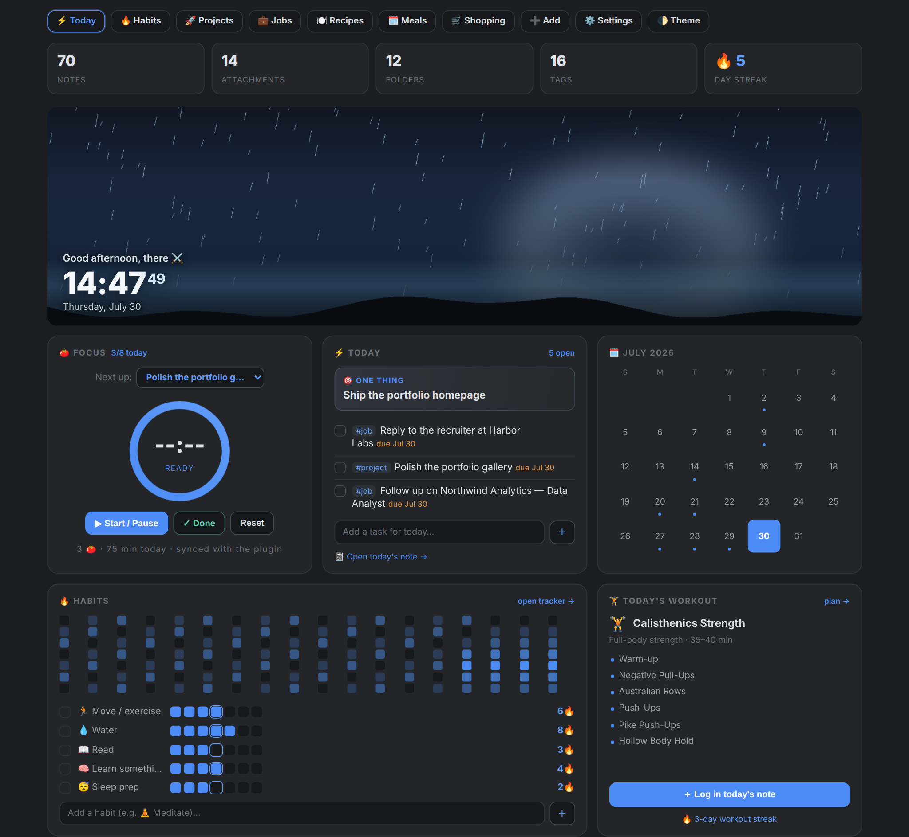

# Almost an Obsidian OS

A complete Obsidian vault built around one DataviewJS dashboard. It runs a job-search pipeline, a recipe box with a meal planner and shopping list, a reading shelf, a six-day training plan with animated form demos, a habit system with a heatmap, and a focus timer. Everything renders from tagged Markdown, so the views stay disposable and your notes stay the source of truth.

I built this template based off a vault I made to organize my own life. It might be a good starting point for you, but it will need a decent amount of work. I may not be responsive with pull requests as I'm not a developer and could have trouble validating any work. Instead, I recommend you take this template and run with it however you want in your own repos.

This vault ships with sample data so every widget is alive the moment you open it. Clear it out and it becomes yours.

## What's inside

- **One dashboard note** that gathers from across the vault and renders a Today card, a focus timer, a month calendar, a habit heatmap, today's workout, a job pipeline, goals and their next moves, a reading shelf, and a mini graph.
- **A job tracker** with a status pipeline (saved → applied → screen → interview → final → offer), inline status dropdowns, starring, and per-role notes.
- **Recipes → meal planner → shopping list**, one source feeding three views.
- **A reading shelf** with cover cards and progress bars.
- **Goals → tasks → sub-tasks.** Goal notes carry a Gantt of the tasks that point to them; every task note carries a 📆 Timeline of its own sub-tasks — bars from real 📅 dates, dashed projected bars for undated ones (click to accept a date), and click-to-check boxes. The dashboard's ⚡ Now card shows each active task's next move.
- **A habit system** built entirely from `#habit/*` checkboxes in your daily notes. No habit database; the checkbox is the record.
- **A six-day training plan** with looping GIF form demos for each exercise.
- **Two theme modes.** *Community theme* makes the dashboard follow whatever Obsidian theme you have installed. *Match image* builds the dashboard's colors from your banner image, going light or dark to match it, contrast-corrected to WCAG AA. Switch in the dashboard's ⚙️ Settings.
- **A wind-down plugin** that nudges you off the screen at night. It gets obnoxious if you ignore it. To dismiss it early you have to type the opening paragraph of Moby-Dick.

## Quick start

1. **Open the vault.** In Obsidian, choose "Open folder as vault" and pick the `Storm Dashboard Vault` folder inside this download.
2. **Open `🧭 START HERE`** and follow it. The short version:
   - Install the community plugins listed below, then enable them.
   - Turn on **Dataview → Enable JavaScript Queries**.
   - Point **Templater**'s template folder at `_templates` and enable "Trigger on new file creation".
   - Enable the **storm** and **dashboard** CSS snippets (Settings → Appearance).
   - Set **Homepage** to `Dashboard`.
3. **Make it yours.** Set your name in the Dashboard note's properties, pick a theme in ⚙️ Settings, and start deleting the sample notes.

Until the plugins are installed and JavaScript queries are on, the dashboard shows a code block instead of rendering. That is expected. Finish setup and it comes to life.

## Required plugins

Install these from Obsidian's community plugin browser (Settings → Community plugins → Browse):

- Dataview
- Tasks
- Templater
- Calendar
- Heatmap Calendar
- Homepage
- Pomodoro Timer

The custom **Storm Wind-Down** plugin is already bundled in `.obsidian/plugins/storm-winddown`. Just enable it in the list.

These third-party plugins are not included in this download. Each is maintained and licensed by its own author. See `LICENSE` for details.

## How it was built

`How this vault was built.md` at the root of the vault is a full technical write-up: the render architecture, the three write-back APIs behind every button, the query pattern behind each board, and the one place the system drops to a custom plugin. Read it if you want to extend the vault or build your own.

## License

I don't care what you do with it. Remember, with great vault comes great responsibility.
